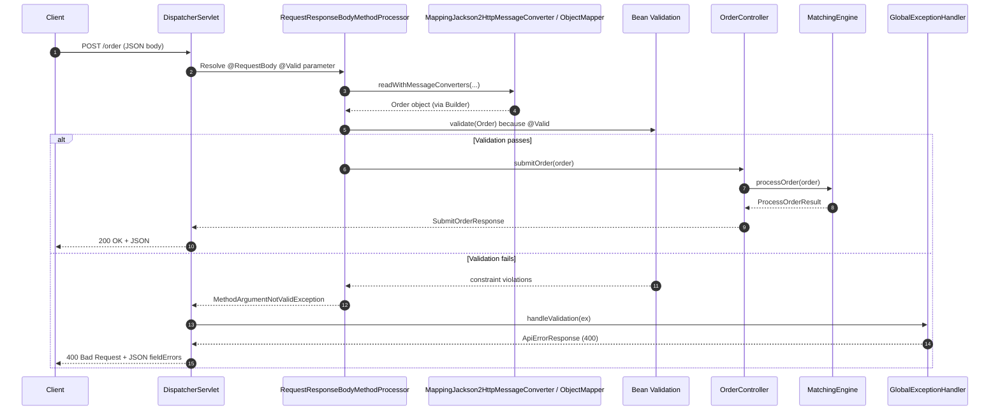

# Step-by-Step Request Pipeline (Detailed)

## Recent Progress Log (since this file was last updated)

This section is a quick memory refresher of what was implemented and learned recently.

### 1) API + docs improvements

- Added OpenAPI/Swagger via SpringDoc.
- Added Swagger request examples for `POST /order`.
- Updated `README.md` to match current behavior and endpoints.

### 2) Order status endpoint

- Added `GET /order/{id}` endpoint.
- Added `OrderStatusResponse` DTO.
- Added `CANCELLED` to `OrderStatus`.
- `MatchingEngine` now tracks order status by id.

### 3) Concurrency learning path and implementation

We intentionally did this in two steps:

1. **Safety first:** global lock in `MatchingEngine` so behavior is correct under concurrency.
2. **Then performance:** refactor to **per-symbol locks** so different markets can process in parallel.

Current model:

- `symbolLocks` map stores one lock object per symbol.
- Same-symbol operations are serialized.
- Different symbols can run concurrently.
- `orderToSymbol` index allows targeted cancel by id without scanning every book.

### 4) Concurrency tests added

In `MatchingEngineTest`:

- Concurrent submits consistency test (many orders at once).
- Submit-vs-cancel race test with two valid outcomes documented.
- Cross-symbol isolation test (BTC and ETH concurrent submits stay separated).

### 5) Persistence setup (Postgres + JPA wiring)

- Added dependencies:
  - `spring-boot-starter-data-jpa`
  - PostgreSQL JDBC driver
- Datasource in `application.properties` with env-var overrides (`DB_URL`, `DB_USERNAME`, `DB_PASSWORD`).
- Initial JPA/Hibernate settings:
  - `spring.jpa.hibernate.ddl-auto=update` (temporary; later replace with Flyway migrations)
  - `spring.jpa.properties.hibernate.jdbc.time_zone=UTC`

### 6) First persistence slice: persist trades

**Package:** `com.alex.trading_engine.persistence` — a normal name; a `repository`-only package is also common.

**`TradeEntity`**

- JPA **entity**: maps a Java class to SQL table `trades`.
- `@Entity`, `@Table`, `@Id`, `@GeneratedValue(IDENTITY)` — row identity and table name.
- `@Column(nullable = false)` — required columns.
- `precision` / `scale` on `BigDecimal` — fixed decimal columns (e.g. money), avoids floating-point drift.
- Protected no-arg constructor — JPA/Hibernate needs it for reflection.
- `fromDomain(Trade)` — mapper from domain `Trade` to entity; a common pattern.

**`TradeRepository`**

- Extends `JpaRepository<TradeEntity, Long>` — Spring Data JPA generates the implementation at runtime (no hand-written DAO).
- In a running app, Spring registers that bean; you inject `TradeRepository` where needed.

**`MatchingEngine` integration**

- Optional `TradeRepository` via `@Autowired(required = false)` setter — unit tests can use `new MatchingEngine()` without Spring; the full app injects the real repository.
- After `book.processOrder(...)`, compare trade list size before/after; persist only **new** trades (size often unchanged when the order only rests — no match).
- `trades.size() <= tradeCountBefore`: usually means no new trade (`==`); with current `OrderBook` logic, size does not shrink during `processOrder`, so `<` is only defensive.

**Tests**

- `MatchingEngineTest`: mock `TradeRepository`; assert `saveAll` runs when a match creates a trade, and not for a resting-only submit.

**Misc**

- `@SuppressWarnings("null")` on one test — quiets IDE null-analysis warnings around Mockito `verify(...).saveAll(...)`, not runtime behavior.

### 7) Key concepts (plain language)

- **Spring Data JPA**: Spring’s way to talk to SQL through repository interfaces.
- **Hibernate ORM** (under JPA): maps entities ↔ tables and runs SQL.
- **Hibernate Validator**: separate from ORM — powers Bean Validation on HTTP bodies (`@NotBlank`, etc.).
- **`getTrades()` copy-then-sort**: per-symbol locks → snapshot each book under its lock, then merge/sort globally.

### 8) What is next

- Order lifecycle / status persistence, and optionally `GET /trades` backed by DB for a single source of truth.
- Startup recovery: rebuild open orders in memory from DB.
- Replace `ddl-auto=update` with **Flyway** migrations for production-style schema versioning.

## 1) HTTP arrives at Spring `DispatcherServlet`

The Spring Boot app receives `POST /order`.

Spring's central web component (`DispatcherServlet`) selects the matching controller method:

```java
submitOrder(@Valid @RequestBody Order order)
```

This method signature tells Spring:

- `@RequestBody`: read the request body and convert it into `Order`
- `@Valid`: run Bean Validation after the object is created

### Q: What happens at `@RequestBody`? How does Spring ask Jackson to deserialise?

Short flow inside Spring MVC:

1. `DispatcherServlet` finds `OrderController#submitOrder(...)`.
2. `RequestResponseBodyMethodProcessor` handles parameters annotated with `@RequestBody`.
3. It calls `readWithMessageConverters(...)`.
4. Spring iterates registered `HttpMessageConverter`s and picks `MappingJackson2HttpMessageConverter` for JSON.
5. That converter calls Jackson `ObjectMapper.readValue(...)` to create `Order`.

Rough internal call chain:

```java
DispatcherServlet#doDispatch
  -> RequestMappingHandlerAdapter#invokeHandlerMethod
    -> ServletInvocableHandlerMethod#getMethodArgumentValues
      -> RequestResponseBodyMethodProcessor#resolveArgument
        -> AbstractMessageConverterMethodArgumentResolver#readWithMessageConverters
          -> MappingJackson2HttpMessageConverter#readInternal
            -> ObjectMapper#readValue(...)
```

## 2) Spring asks Jackson to deserialize `@RequestBody` into `Order`

Because `Order` has:

```java
@JsonDeserialize(builder = Order.Builder.class)
@JsonPOJOBuilder(withPrefix = "")
```

### Q: What is `withPrefix = ""` for?

It tells Jackson that builder methods have **no prefix**.  
So Jackson maps JSON properties directly to methods like:

- `"symbol"` -> `symbol(...)`
- `"price"` -> `price(...)`

Without this, Jackson usually expects builder methods like `withSymbol(...)` or `setSymbol(...)` depending on config.

Jackson uses the builder pattern roughly like this:

```java
new Order.Builder()
    .id("o-1")
    .symbol("")
    .price(31000)
    .quantity(0)
    .orderSide(BUY)
    .build();
```

Important: manual checks were removed from `build()`, so `build()` no longer throws for blank symbol or zero quantity.  
That is good because Bean Validation can now return consistent, structured errors.

## 3) Bean Validation runs because of `@Valid`

Spring validates the created `Order` using its field annotations:

- `@NotBlank` on `symbol` -> fails because value is `""`
- `@DecimalMin(value = "0.0", inclusive = false)` on `quantity` -> fails because `0` is not strictly greater than `0`
- Other fields may pass

When one or more constraints fail, Spring throws:

```java
MethodArgumentNotValidException
```

The controller method body (`matchingEngine.processOrder(...)`) is **not** called.

## 4) Exception is routed to the global handler

Because `GlobalExceptionHandler` uses `@RestControllerAdvice`, Spring looks for a handler for this exception type.

It finds:

```java
handleValidation(MethodArgumentNotValidException ex)
```

That method:

- loops over field errors from the binding result
- builds a `fieldErrors` map such as:
  - `"symbol" -> "symbol is required"`
  - `"quantity" -> "quantity must be positive"`
- returns `ResponseEntity.badRequest()` with `ApiErrorResponse`

## 5) Spring serializes the error DTO back to JSON

`ApiErrorResponse` is converted to JSON (via Jackson, now in reverse direction) and sent as the HTTP response:

- status: `400`
- body: JSON with `timestamp`, `status`, `message`, and `fieldErrors`

Result: the client gets consistent validation output.

## Q: Can you show relevant code for all steps (including Spring/Jackson internals)?

Yes. Here is the code map.

### Your project code (actual files)

1. Controller entry point (`@RequestBody` + `@Valid`):

```java
@PostMapping("/order")
public SubmitOrderResponse submitOrder(@Valid @RequestBody Order order) {
    var result = matchingEngine.processOrder(order);
    return new SubmitOrderResponse(result.orderId(), result.status());
}
```

File: `src/main/java/com/alex/trading_engine/controller/OrderController.java`

1. Jackson builder config + validation annotations:

```java
@JsonDeserialize(builder = Order.Builder.class)
public class Order {
    @NotBlank(message = "symbol is required")
    private final String symbol;
    @DecimalMin(value = "0.0", inclusive = false, message = "quantity must be positive")
    private final double quantity;

    @JsonPOJOBuilder(withPrefix = "")
    public static class Builder {
        public Builder symbol(String symbol) { ... }
        public Builder quantity(double quantity) { ... }
        public Order build() { return new Order(this); }
    }
}
```

File: `src/main/java/com/alex/trading_engine/model/Order.java`

1. Validation exception handler:

```java
@ExceptionHandler(MethodArgumentNotValidException.class)
public ResponseEntity<ApiErrorResponse> handleValidation(MethodArgumentNotValidException ex) {
    Map<String, String> fieldErrors = new LinkedHashMap<>();
    for (FieldError err : ex.getBindingResult().getFieldErrors()) {
        fieldErrors.putIfAbsent(err.getField(), err.getDefaultMessage());
    }
    return ResponseEntity.badRequest().body(
        new ApiErrorResponse(Instant.now(), 400, "Validation failed", fieldErrors)
    );
}
```

File: `src/main/java/com/alex/trading_engine/controller/GlobalExceptionHandler.java`

1. Error response DTO:

```java
public record ApiErrorResponse(
    Instant timestamp,
    int status,
    String message,
    Map<String, String> fieldErrors
) {}
```

File: `src/main/java/com/alex/trading_engine/controller/dto/ApiErrorResponse.java`

### Spring/Jackson internal classes (framework code path)

These classes are in Spring Framework / Jackson libraries:

- `org.springframework.web.servlet.DispatcherServlet`
- `org.springframework.web.servlet.mvc.method.annotation.RequestMappingHandlerAdapter`
- `org.springframework.web.servlet.mvc.method.annotation.RequestResponseBodyMethodProcessor`
- `org.springframework.http.converter.json.MappingJackson2HttpMessageConverter`
- `com.fasterxml.jackson.databind.ObjectMapper`

Validation internals after deserialization:

- `RequestResponseBodyMethodProcessor` triggers validation when it sees `@Valid`
- Bean Validation checks annotations (`@NotBlank`, `@DecimalMin`)
- On failure, Spring throws `MethodArgumentNotValidException`
- `ExceptionHandlerExceptionResolver` routes to `@RestControllerAdvice` handler

### Important clarification: "Hibernate" in this context

You are not using Hibernate ORM/JPA for database persistence here.

When I said Hibernate earlier, I meant **Hibernate Validator**, which is the Bean Validation implementation used by Spring Boot via:

```xml
<artifactId>spring-boot-starter-validation</artifactId>
```

So in your app:

- no JPA entities/repositories are required for this validation flow
- validation still works because it is request DTO/domain-object validation, not ORM mapping

## Sequence diagram (end-to-end flow)

